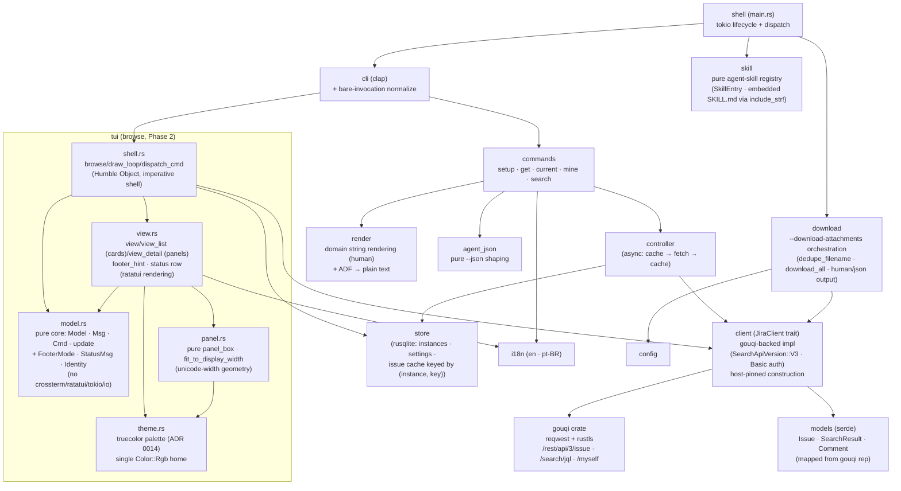
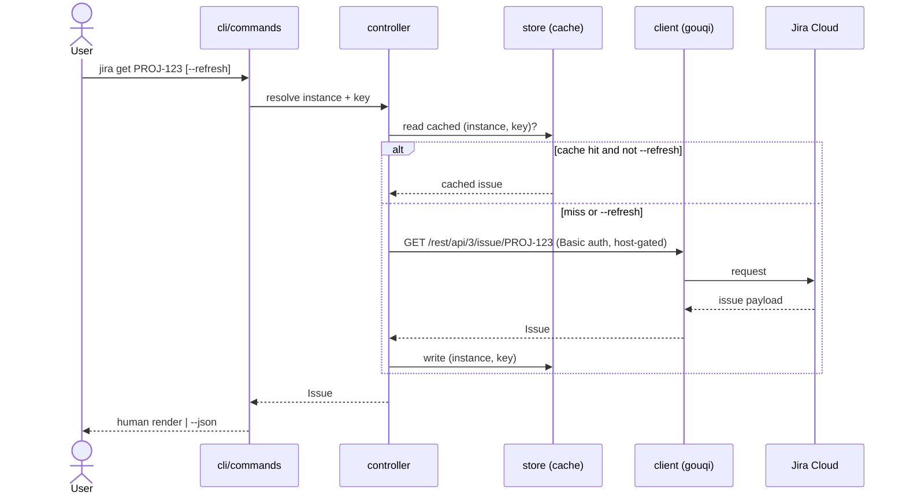

# Architecture

Living diagrams of the `jira-cli` Rust app, a fork of `active-collab-cli`
([ADR 0001](/adr/0001-fork-active-collab-cli-swap-api.md)) with the domain layer
swapped to Jira Cloud ([ADR 0002](/adr/0002-jira-cloud-only-basic-auth.md)). Node
names use [context-index](/context/index.md) vocabulary. v1 is CLI-first. The fork's
`tui/` was **not** carried over; Phase 2 adds a fresh, read-only `browse` TUI built as
an Elm/TEA shell on ratatui + crossterm over the same domain core
([ADR 0007](/adr/0007-browse-tui-elm-architecture.md)) — all slices have landed: the
list, issue detail (cache-or-fetch), interactive JQL search, and the read affordances
(open link / copy key), covering [PRD 0002](/prd/0002-interactive-browse-tui.md) R1–R4.
This view is updated as each structural change lands (maintenance invariant).

## Design principles

The architecture is a **modular monolith** (single binary, no service/process
split — microservices are earned, not a starting point) built from **deep modules**
(Ousterhout: powerful functionality behind a narrow interface) over a **Functional
Core, Imperative Shell** (Bernhardt) — the constitution's "pure, testable core"
non-negotiable. Pure logic (ref parsing, branch-key extraction, JQL build,
`agent_json` shaping, ADF flatten) touches no I/O; the thin shell (`controller`
async, `store`, the gouqi-backed `client`) does the side effects.

Three standing guardrails keep modules deep and the system intelligible. They are
**constraint ACs on every slice** (Reviewer-judged):

1. **Curated domain models, not a gouqi mirror.** `models` exposes only the fields
   the tool uses; it is **not** a 1:1 pass-through of gouqi's `rep` types. A
   pass-through mapping adds interface cost while hiding nothing (a shallow module)
   — the point of the boundary is to decouple our contract from gouqi, not to copy it.
2. **Thin commands.** `commands` handlers dispatch and format only; all
   orchestration lives in `controller`/`client`. Logic scattered across command
   handlers is "classitis" and defeats traceability.
3. **One seam, earned.** The `JiraClient` trait is the single deliberate abstraction
   seam (it pays for itself: swap path + host-isolation + testability). We do not
   wrap every module behind a trait "for testability" (test-induced design damage)
   — prefer a pure function before reaching for DI; add a seam only where a deletion
   test shows it earns its keep.

## Module structure

The `tui` (`browse`) shell is a **second imperative shell** over the same functional
core, now split into its own submodule (`src/tui/`) per
[ADR 0007 §6](/adr/0007-browse-tui-elm-architecture.md): `model.rs` is the pure
functional core — a pure `update(Model, Msg) -> (Model, Vec<Cmd>)` drives
navigation/scroll/search state (unit + ratatui `TestBackend` tested) and imports
nothing from crossterm/ratatui/tokio/`std::io`; `view.rs` maps `Model` to ratatui
widgets; `shell.rs` is the Humble Object — the imperative shell that owns the
terminal, the draw loop, and command dispatch. `Cmd` effects reuse the existing
data seams — `client` (`JiraClient::search` for lists, cache-or-fetch for detail) and
`store` — never the rendering `*_core` functions. Read-only by construction
([ADR 0007](/adr/0007-browse-tui-elm-architecture.md)).

Browse **entry** is stale-while-revalidate
([ADR 0016](/adr/0016-swr-first-paint-browse-entry.md)): `fetch_and_run` first
reads the `task_list_cache` snapshot (`store`, scope `"mine"`, keyed by
`instances_key`, 7-day max-age) — a warm hit opens the TUI instantly with
`revalidating: true` and one `Cmd::RevalidateList` revalidating inside the
async loop (the completion swaps the rows and rewrites the snapshot at the
shell seam); a cold entry keeps the pre-TUI blocking fetch and seeds the
snapshot. The single-flight and late-result guards live in the pure `update`
([BDR 0008](/bdr/0008-browse-entry-swr-behaviors.md)).

The Group-D design system ([ADR 0014](/adr/0014-tui-visual-design-system.md))
added two presentation modules: `theme.rs` — the single home of every
`Color::Rgb` literal (grep-enforced) exposing named style constructors — and
`panel.rs` — the pure rounded-panel/display-width geometry (`panel_box`,
`fit_to_display_width`, `ellipsize_display`) that composes the detail's
Details/Description/Comments panels. The list renders per-issue cards (due
color from the shared `relative_due` delta); the footer is a single mode-aware
`footer_hint(FooterMode)`; a transient `StatusMsg` row is cleared by `update()`
on the next key event. ADF `table` nodes render one line per row through the
single `render` mapper (CLI and TUI identical).

The Group-B interaction layer builds on one invariant: **`compose_detail` is
the single geometry pass** for the detail screen. Its per-visual-row cell
metadata carries both `href` and logical provenance `(logical_line,
char_start, char_len)`, so modifier-click link activation
([ADR 0018](/adr/0018-inline-body-links-modifier-click.md)), app-managed text
selection in logical coordinates
([ADR 0019](/adr/0019-app-managed-text-selection.md)), and the Attachments
panel's clickable rows ([ADR 0020](/adr/0020-issue-attachments-detail-panel.md))
all resolve through the same metadata — no second wrap/border/scroll math
anywhere. Mouse capture is always-on
([ADR 0017](/adr/0017-mouse-support-browse-tui.md)); the shell maps raw mouse
events to plain-data `Msg`s via pure `view` resolvers. The Projects axis
([ADR 0021](/adr/0021-projects-axis-browse.md)) adds `Screen::Projects` plus a
`ListOrigin` provenance field instead of a pushdown stack — `p` lists
projects (`JiraClient::list_projects`), Enter swaps the list JQL to the
project and reuses the entire list machinery; back pops
Detail → project list → Projects → mine (single-source `MINE_JQL`).

**Boundaries / fitness:**

- **`client` (the gouqi-backed `JiraClient` impl) is the only outbound-network
  boundary** ([ADR 0005](/adr/0005-jira-client-on-gouqi-behind-trait.md)). gouqi
  owns the reqwest transport, so token host isolation is a **wrapper invariant**:
  the wrapper is the single `gouqi::Jira` construction site and always builds it
  from the resolved instance host. Gate-checked by a unit test
  ([PRD 0001](/prd/0001-jira-cloud-read-cli.md) NFR-1) that the wrapper never
  targets a host other than the instance `base_url` host.
- **`store` owns all persistence;** no other module opens the SQLite file. The
  issue cache is keyed by `(instance_name, issue_key)`
  ([ADR 0003](/adr/0003-issue-identity-and-cache-key.md)).
- **`agent_json` is pure** and derived from the same helpers as `render`, so the
  JSON contract and the human text never drift
  ([ADR 0004](/adr/0004-agent-json-output-contract.md)); a field rename/drop fails
  a unit test.
- **`skill` is pure** and network-free, mirroring the `agent_json` purity
  discipline: `jira skill [name]` serves the embedded agent skill contract
  from a `&[SkillEntry]` registry, its `jira` entry's body sourced from the
  single canonical `.claude/skills/jira/SKILL.md` via `include_str!` so the
  command and the file can never drift ([ADR 0028](/adr/0028-agent-skill-served-by-jira-skill-command.md),
  [BDR 0019](/bdr/0019-jira-skill-command-behaviors.md)). `"skill"` is a
  `KNOWN_COMMANDS` entry, dispatched directly from `main.rs` (no TUI, no
  store, no network).
- **`client` is a clean trait seam** so a Phase-2 Jira Server/DC (REST v2) adapter
  is additive, not a rewrite.
- **`download` orchestrates `jira get --download-attachments`**
  ([ADR 0029 §2](/adr/0029-attachments-authenticated-download-seam-download-attachments-and-external-image-viewer.md),
  [BDR 0020 S4-S7](/bdr/0020-attachment-download-and-external-image-viewer-behaviors.md)):
  it fetches every attachment through `client`'s same-origin
  `download_attachment` seam and writes each to `config::jira_config_dir()`'s
  `downloads/<KEY>/` (or `--download-dir`), disambiguating duplicate
  filenames with a pure `dedupe_filename` before any write. `main.rs` wires
  the flag on the shared `DisplayArgs` for both `get` and `current`; download
  mode is download-only and never also renders the full issue.

## Read data flow (local-first)

The cache makes reads **local-first**: a cached `get` succeeds with the network
disabled (NFR-2); `--refresh` forces the fetch arm. The list commands
(`mine`/`search`) issue a JQL request to `/rest/api/3/search/jql` and render the
result page; per-issue caching of list results is deferred (PRD open question).

## Quality gates

The crate inherits the AC `comment_policy` integration test (`tests/comment_policy.rs`,
run by `cargo test`): no banner/divider comments and no commented-out Rust code,
while doc comments (`///`, `//!`) and non-obvious why-comments are allowed.
