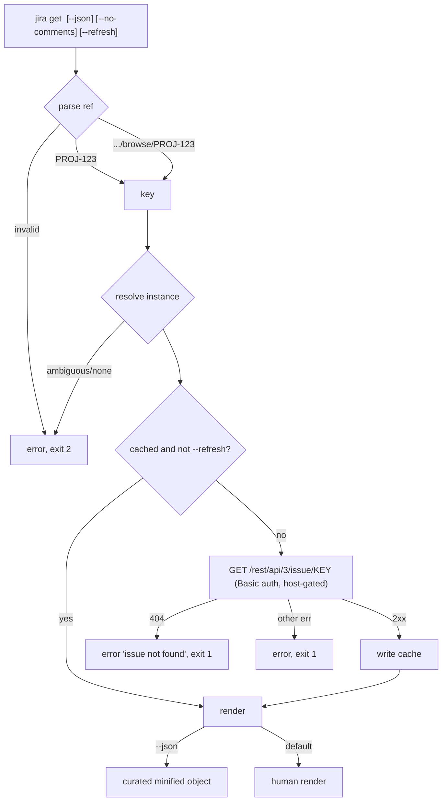

# 0001. get an issue by key or URL

## Context

`get` is the v1 walking skeleton's user-observable behavior: the thinnest path
through every layer (auth → client → render → cache). Delivered by slice J0
([Issue 0001](/issues/0001-j0-skeleton-setup-get.md)) under
[PRD 0001](/prd/0001-jira-cloud-read-cli.md) R2/R7, implementing
[ADR 0002](/adr/0002-jira-cloud-only-basic-auth.md),
[ADR 0003](/adr/0003-issue-identity-and-cache-key.md), and
[ADR 0004](/adr/0004-agent-json-output-contract.md).

## Behavior

## Textual Description

- **Input.** `get <ref>` where `<ref>` is a bare issue key `PROJ-123` or a browser
  URL `https://<site>.atlassian.net/browse/PROJ-123`. Flags: `--instance`,
  `--json`, `--no-comments`, `--refresh`.
- **Resolution.** The key is parsed from the ref; the instance is resolved
  (explicit `--instance`, else the single configured instance, else ambiguity
  error exit 2).
- **Fetch.** On a cache miss or `--refresh`, `GET /rest/api/3/issue/{key}` with
  Basic auth, attached only to the instance host. The fetched issue is written to
  the cache keyed `(instance, key)`.
- **Human render.** Summary, key, status, issue type, assignee, priority,
  created/updated, description (ADF flattened to text), and comments unless
  `--no-comments`.
- **agent_json.** `--json` prints the curated one-line object from
  [ADR 0004](/adr/0004-agent-json-output-contract.md).
- **Exit codes.** Success 0; not-found / HTTP error 1; bad ref / missing or
  ambiguous instance 2.

## Scenarios

**Scenario 1: get by key (cache miss)** — `jira get PROJ-123` with no cache fetches
the issue, writes the cache, and prints the human render; exit 0.
**Scenario 2: get by URL** — `jira get https://acme.atlassian.net/browse/PROJ-123`
resolves to key `PROJ-123` and behaves as Scenario 1.
**Scenario 3: --json** — `jira get PROJ-123 --json` prints exactly one minified
line whose `ref` is `PROJ-123`; exit 0.
**Scenario 4: not found** — a key the API returns 404 for prints a not-found error
and exits 1.
**Scenario 5: ambiguous instance** — with two instances and no `--instance`, exit 2
with an ambiguity message; no network call.
**Scenario 6: --no-comments** — `comments` is `[]` in `--json` and the comments
block is omitted from the human render.

## Test Design

Ref parsing, instance resolution, ADF→text, and `agent_json` shaping are pure unit
tests with no I/O. The fetch+cache path is integration-tested against a **wiremock**
Jira and a **temp SQLite** store by injecting the HTTP base + store path. Each row
names what it proves.

| Case | Level | Scenario | Asserts (observable) | Proves |
|---|---|---|---|---|
| Parse key | unit | 1 | "PROJ-123" → key PROJ-123 | ref parsing |
| Parse URL | unit | 2 | browse URL → key PROJ-123 | URL parsing |
| Bad ref | unit | — | invalid ref → exit 2 | input guard |
| JSON shape | unit | 3 | one line, ref==key, locked fields | contract stability |
| ADF flatten | unit | — | ADF doc → plain text | description rendering |
| Get happy | integration | 1 | issue fetched (wiremock), cache row written, human render, exit 0 | fetch+cache+render |
| Get --json | integration | 3 | minified object, exit 0 | json path end-to-end |
| Not found | integration | 4 | 404 → error string, exit 1 | error path + exit |
| Token host-gate | integration | — | no Authorization to a non-instance host | NFR-1 isolation |
| No-comments | integration | 6 | comments omitted/[]  | flag contract |

## Related

- PRD: [/prd/0001-jira-cloud-read-cli.md](/prd/0001-jira-cloud-read-cli.md)
- ADR: [/adr/0003-issue-identity-and-cache-key.md](/adr/0003-issue-identity-and-cache-key.md)
- ADR: [/adr/0004-agent-json-output-contract.md](/adr/0004-agent-json-output-contract.md)
- Issue: [/issues/0001-j0-skeleton-setup-get.md](/issues/0001-j0-skeleton-setup-get.md)
