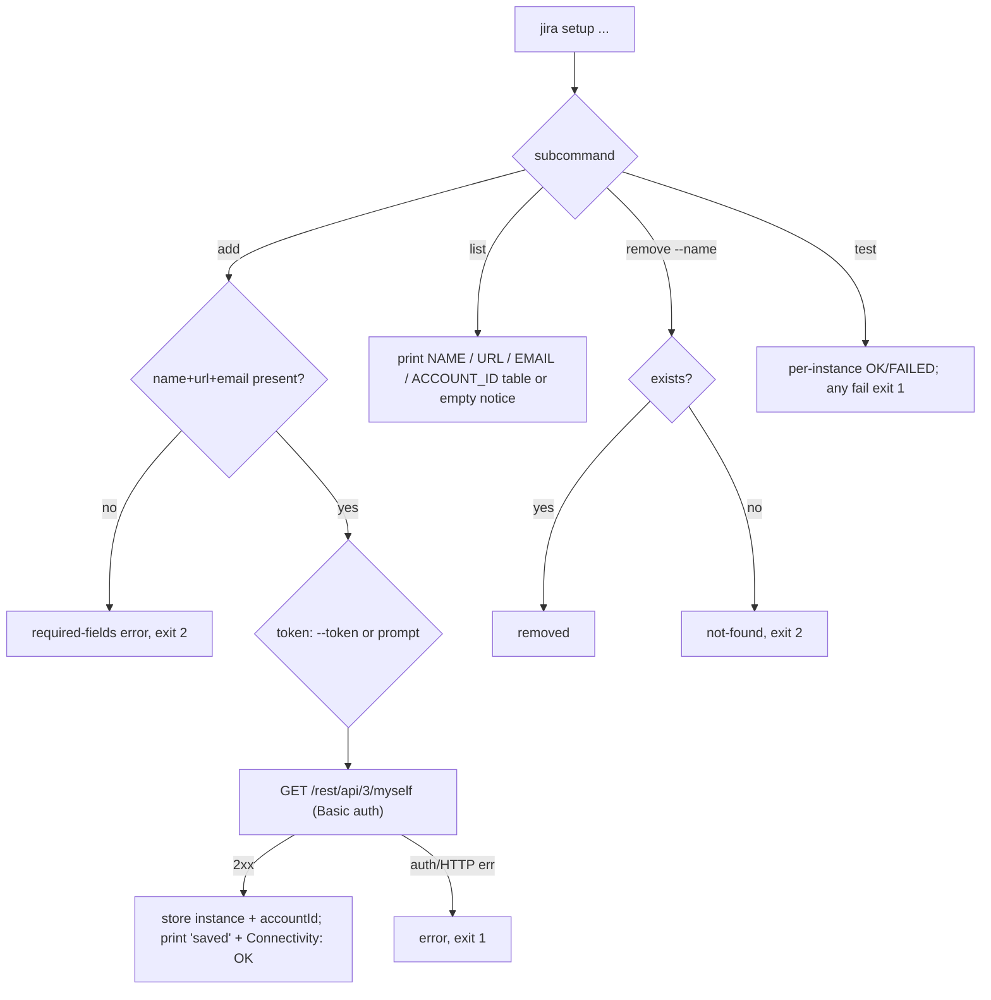

# 0002. setup: add/list/remove/test Jira Cloud instances

## Context

Every read command needs a configured instance to authenticate. `setup` is the
prerequisite, delivered alongside the skeleton in slice J0
([Issue 0001](/issues/0001-j0-skeleton-setup-get.md)) under
[PRD 0001](/prd/0001-jira-cloud-read-cli.md) R1, implementing
[ADR 0002](/adr/0002-jira-cloud-only-basic-auth.md).

## Behavior

## Textual Description

- **add** (`--name --url --email`, token via `--token` or interactive prompt):
  validates required fields (missing → `Error: --name, --url and --email are
  required.` exit 2); calls `GET /rest/api/3/myself` with Basic auth to verify and
  resolve the `account_id`; on success stores the instance and prints
  `Instance '{name}' saved.` plus `Connectivity: OK`; on failure prints
  `Connectivity: FAILED (HTTP {status})` and exits 1. The token is never echoed.
- **list**: prints a `NAME / URL / EMAIL / ACCOUNT_ID` table, or
  `No instances configured. Run: jira setup add` when empty (exit 0).
- **remove --name**: `Instance '{name}' removed.` or
  `Error: instance '{name}' not found.` (exit 2).
- **test [--name]**: per instance `  {name}: OK` / `  {name}: FAILED (HTTP
  {status})`; any failure → exit 1; a named-but-missing instance → exit 2.

## Scenarios

**Scenario 1: add happy path** — valid fields + token verify against `/myself`
stores the instance with its `account_id` and prints saved + `Connectivity: OK`;
exit 0.
**Scenario 2: add missing fields** — omitting `--email` prints the required-fields
error; exit 2; nothing stored.
**Scenario 3: add bad token** — `/myself` returns 401; prints
`Connectivity: FAILED (HTTP 401)`; exit 1; nothing stored.
**Scenario 4: list empty** — no instances prints the empty notice; exit 0.
**Scenario 5: remove missing** — `setup remove --name nope` prints not-found;
exit 2.
**Scenario 6: token not echoed** — an interactive add never prints the token.

## Test Design

Field validation and table formatting are pure unit tests. The verify/store path is
integration-tested against **wiremock** (`/myself`) and a **temp SQLite** store.

| Case | Level | Scenario | Asserts (observable) | Proves |
|---|---|---|---|---|
| Validate fields | unit | 2 | missing field → exit 2 string | required-arg guard |
| List format | unit | 4 | empty notice string | empty contract |
| Add happy | integration | 1 | accountId resolved + stored, saved+OK strings, exit 0 | verify+store |
| Add bad token | integration | 3 | FAILED (HTTP 401), exit 1, nothing stored | auth error path |
| Remove missing | integration | 5 | not-found string, exit 2 | error path + exit |
| Token secrecy | integration | 6 | token absent from stdout | no-echo guard |

## Related

- PRD: [/prd/0001-jira-cloud-read-cli.md](/prd/0001-jira-cloud-read-cli.md)
- ADR: [/adr/0002-jira-cloud-only-basic-auth.md](/adr/0002-jira-cloud-only-basic-auth.md)
- Issue: [/issues/0001-j0-skeleton-setup-get.md](/issues/0001-j0-skeleton-setup-get.md)
