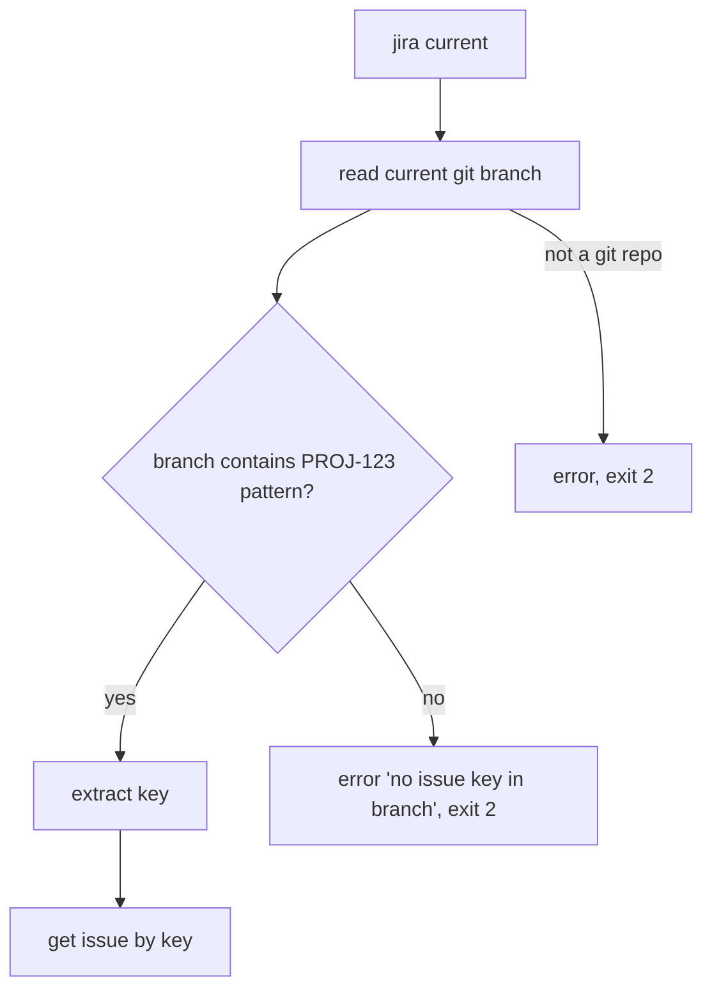

# 0004. current: derive the issue key from the git branch

## Context

Looking up the issue behind the branch is the headline terminal workflow. Slice J2
([Issue 0003](/issues/0003-j2-current-from-branch.md)) delivers it under
[PRD 0001](/prd/0001-jira-cloud-read-cli.md) R4, reusing the `get` path
([BDR 0001](/bdr/0001-get-issue-by-key.md)).

## Behavior

## Textual Description

- **Branch read:** the current branch name is read from git.
- **Key extraction:** the first substring matching the Jira key pattern
  `[A-Z][A-Z0-9]+-\d+` is the issue key. It matches regardless of branch prefix
  (`feature/PROJ-123-foo`, `bugfix/PROJ-123`, `PROJ-123`).
- **Reuse get:** the extracted key flows through the `get` path (cache-first,
  `--json`, `--no-comments`, `--refresh`, `--instance` all apply).
- **No key / not a repo:** exit 2 with a clear message; no network call.

## Scenarios

**Scenario 1: prefixed branch** — on `feature/PROJ-123-add-login`, `jira current`
extracts `PROJ-123` and renders the issue.
**Scenario 2: bare key branch** — on `PROJ-123`, extracts `PROJ-123`.
**Scenario 3: no key** — on `main`, exit 2 with a no-key message; no network.
**Scenario 4: --json passthrough** — `jira current --json` prints the curated
object for the branch's issue.
**Scenario 5: lowercase / non-key** — on `feature/login`, no match → exit 2.

## Test Design

Key extraction is a pure unit test over branch-name fixtures (the riskiest logic).
The end-to-end read reuses the `get` integration harness with a stubbed branch.

| Case | Level | Scenario | Asserts (observable) | Proves |
|---|---|---|---|---|
| Extract prefixed | unit | 1 | "feature/PROJ-123-x" → PROJ-123 | key regex |
| Extract bare | unit | 2 | "PROJ-123" → PROJ-123 | key regex |
| No key | unit | 3,5 | "main"/"feature/login" → None | negative match |
| Multi-token | unit | — | first key wins on multiple matches | determinism |
| Current happy | integration | 1 | branch→key→issue rendered, exit 0 | end-to-end reuse |
| No key exit | integration | 3 | error string, exit 2, 0 requests | guard + exit |

## Related

- PRD: [/prd/0001-jira-cloud-read-cli.md](/prd/0001-jira-cloud-read-cli.md)
- BDR: [/bdr/0001-get-issue-by-key.md](/bdr/0001-get-issue-by-key.md)
- Issue: [/issues/0003-j2-current-from-branch.md](/issues/0003-j2-current-from-branch.md)
