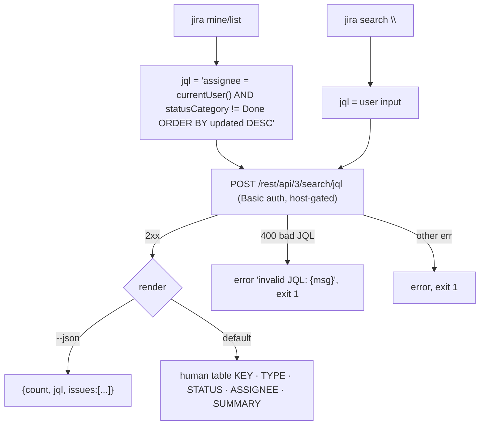

# 0005. mine/list and search — JQL issue listing

## Context

`mine`/`list` and `search` share one JQL listing engine. Slice J3
([Issue 0004](/issues/0004-j3-mine-list.md)) delivers `mine`; slice J4
([Issue 0005](/issues/0005-j4-search-jql.md)) exposes arbitrary JQL via `search`.
Both serve [PRD 0001](/prd/0001-jira-cloud-read-cli.md) R5/R6 and reuse the
`agent_json` list schema ([ADR 0004](/adr/0004-agent-json-output-contract.md)).

## Behavior

## Textual Description

- **mine / list:** builds the fixed JQL
  `assignee = currentUser() AND statusCategory != Done ORDER BY updated DESC` and
  lists the first page. `--limit N` caps page size (default sensible, e.g. 50).
- **search "<jql>":** sends the user's JQL verbatim. A Jira 400 (invalid JQL)
  surfaces the server message and exits 1.
- **Render:** human table (`KEY · TYPE · STATUS · ASSIGNEE · SUMMARY`) or, with
  `--json`, the curated list object `{count, jql, issues:[...]}` (non-interactive).
- **Empty result:** prints a `No issues.` notice (human) or `{"count":0,...}`;
  exit 0.
- **Host isolation** applies to the search request as to `get`.

## Scenarios

**Scenario 1: mine lists open assigned** — `jira mine` builds the currentUser JQL
and prints the matching issues table; exit 0.
**Scenario 2: mine --json** — prints `{count, jql, issues}` one-liner; the `jql`
field is the currentUser query.
**Scenario 3: search arbitrary JQL** — `jira search "project = PROJ ORDER BY updated DESC"`
sends that JQL and lists matches.
**Scenario 4: invalid JQL** — a server 400 prints `invalid JQL: ...` and exits 1.
**Scenario 5: empty result** — a query with no matches prints `No issues.` / count 0;
exit 0.
**Scenario 6: limit** — `--limit 5` requests at most 5 results.

## Test Design

JQL construction (mine), table formatting, and `agent_json` list shaping are pure
unit tests. The search request/response is integration-tested against **wiremock**.

| Case | Level | Scenario | Asserts (observable) | Proves |
|---|---|---|---|---|
| Mine JQL build | unit | 1 | exact currentUser JQL string | query construction |
| Table format | unit | 1 | columns KEY·TYPE·STATUS·ASSIGNEE·SUMMARY | render contract |
| JSON list shape | unit | 2 | {count,jql,issues} locked fields | contract stability |
| Empty render | unit | 5 | "No issues." / count 0 | empty contract |
| Mine happy | integration | 1 | search called with currentUser JQL, table, exit 0 | end-to-end mine |
| Search verbatim | integration | 3 | user JQL sent unchanged, matches listed | search path |
| Invalid JQL | integration | 4 | 400 → error string, exit 1 | error path + exit |
| Limit honored | integration | 6 | request carries the limit | paging cap |
| Token host-gate | integration | — | no Authorization off-host | NFR-1 isolation |

## Related

- PRD: [/prd/0001-jira-cloud-read-cli.md](/prd/0001-jira-cloud-read-cli.md)
- ADR: [/adr/0004-agent-json-output-contract.md](/adr/0004-agent-json-output-contract.md)
- Issue: [/issues/0004-j3-mine-list.md](/issues/0004-j3-mine-list.md)
- Issue: [/issues/0005-j4-search-jql.md](/issues/0005-j4-search-jql.md)
