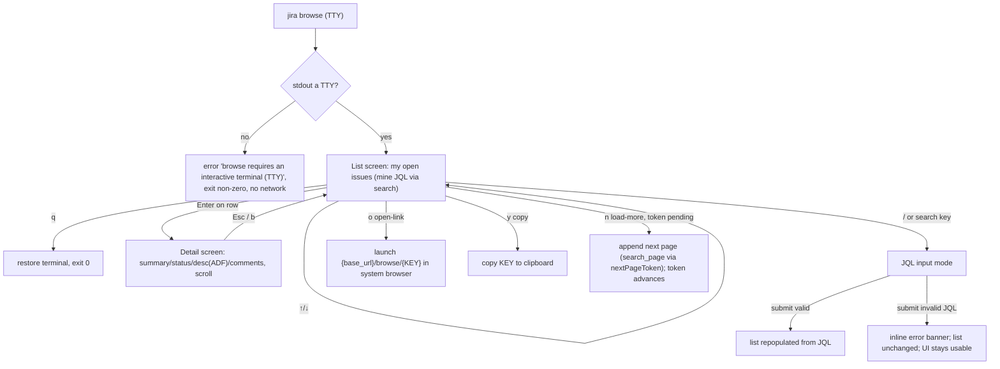

# 0006. browse TUI — interactive read-only navigation

## Context

`jira browse` is the Phase 2 interactive browser ([PRD 0002](/prd/0002-interactive-browse-tui.md))
built as a read-only Elm/TEA app ([ADR 0007](/adr/0007-browse-tui-elm-architecture.md)):
a pure `update(model, msg) -> (Model, Vec<Cmd>)` core and a thin terminal shell. Every
scenario below is a transition decided by `update` (unit-testable) and a rendered
result observable via ratatui `TestBackend` (no real terminal). Data comes from the
existing seams — `JiraClient::search` for lists, the cache-or-fetch issue load for
detail — not the rendering `*_core` functions.

## Behavior

The fetch `Cmd`s (list / detail / search / load-more) run on the **async shell**
([ADR 0008](/adr/0008-browse-tui-async-event-loop.md)): each is spawned on the tokio
runtime and its result returns as a `Msg` over an mpsc channel, so the loop keeps drawing
(the `Loading…` notice is shown and `q` stays responsive) instead of freezing during I/O.

## Textual Description

- **Launch + TTY guard:** `jira browse` enters the alternate screen + raw mode only
  when stdout is a TTY; a non-TTY invocation prints the inherited
  `Error: 'browse' requires an interactive terminal (TTY).` chrome and exits non-zero
  without any network call. On exit (`q`, normal, or panic), raw mode + alternate
  screen are torn down so the terminal is left usable.
- **List screen:** shows my open issues — the same `mine` JQL the CLI uses
  (`assignee = currentUser() AND statusCategory != Done ORDER BY updated DESC`),
  fetched via `JiraClient::search`. Columns mirror the CLI table (KEY · TYPE · STATUS
  · ASSIGNEE · SUMMARY). `↑/↓` move the selection (clamped at both ends); `q` quits.
- **Detail screen:** Enter on the selected row loads that issue (cache-or-fetch) and
  shows summary, status (+category), type, assignee, description (ADF → plain text via
  the existing flattener) and comments; content scrolls. `Esc`/`b` returns to the list
  with the prior selection preserved.
- **Interactive search:** a key opens a JQL input line; submitting sends the JQL via
  `JiraClient::search` and replaces the list contents. An invalid JQL (server 400)
  shows an inline error and leaves the previous list and the UI intact (no crash).
- **Read affordances:** `o` opens `{base_url}/browse/{KEY}` in the system browser; `y`
  copies the selected KEY to the clipboard. Both are read-only.
- **Chrome is translated** via the existing i18n catalog (footer hints, the TTY error)
  — Jira data values are never translated.

## Scenarios

**S1 — launch lists mine.** Given a TTY and configured instance, when I run
`jira browse`, then the list screen shows my open issues and exit is deferred to user
input.
**S2 — non-TTY guard.** Given stdout is not a TTY, when I run `jira browse`, then it
prints the TTY error and exits non-zero, issuing no request.
**S3 — open + back.** Given the list with a selection, when I press Enter then Esc,
then the detail of the selected issue is shown, then the list returns with the same
selection.
**S4 — interactive search.** Given the list, when I enter a valid JQL and submit, then
the list is repopulated with the matches.
**S5 — invalid JQL stays usable.** Given the search input, when I submit an invalid
JQL, then an inline error appears and the prior list + UI remain usable (no panic, no
broken terminal).
**S6 — affordances.** Given a selected row, when I trigger open-link, then the issue's
`/browse/KEY` URL is launched; when I trigger copy, then the KEY is on the clipboard.
**S7 — nav clamps.** Given the selection at the first/last row, when I press ↑/↓ past
the edge, then the selection stays at the edge (no wrap, no out-of-range).
**S8 — load more (pagination).** Given a list whose result has a pending `next_page_token`,
when I trigger load-more (`n`), then the next page is fetched via `search_page` and its rows
are **appended** to the list (selection preserved), and the stored token advances; when the
final page returns (`next_page_token` is `None`), the load-more affordance disappears and a
further load-more is a no-op.
**S9 — responsive during fetch.** Given a fetch (detail/list/search/load-more) is in
flight, when I look at the screen, then a `Loading…`/pending state is drawn (the UI is not
frozen) and `q` still quits — the effect runs off the draw path and returns via the channel
([ADR 0008](/adr/0008-browse-tui-async-event-loop.md)).

## Test Design

The pure `update` transitions and the `view` render are unit-tested; the terminal
shell (raw mode, event loop, browser/clipboard spawn) is the Humble Object validated
by the manual demo gate. `TestBackend` renders `view(model)` to an in-memory buffer
for cell assertions. Data-fetch `Cmd`s are tested against **wiremock** at the client
seam (as the CLI list path already is).

| Case | Level | Scenario | Asserts (observable) | Proves |
|---|---|---|---|---|
| nav select moves | unit | S1/S7 | update(Down) increments selection; clamps at ends | pure nav logic |
| Enter → detail msg | unit | S3 | update(Select) pushes Detail screen + emits LoadDetail Cmd | open transition |
| Esc → back | unit | S3 | update(Back) pops to List, selection preserved | back transition |
| search submit | unit | S4 | update(SubmitSearch) emits LoadList(jql) Cmd | search wiring |
| invalid JQL state | unit | S5 | update(LoadFailed) sets error banner, keeps list | resilience |
| list render | unit (TestBackend) | S1 | buffer shows issue KEYs + header columns | render contract |
| detail render | unit (TestBackend) | S3 | buffer shows summary + status + flattened description | detail render |
| TTY guard | integration | S2 | non-TTY → TTY error, exit non-zero, zero requests | guard + no-network |
| list fetch | integration (wiremock) | S1 | browse list issues the mine JQL via search | data path |
| search fetch | integration (wiremock) | S4 | submit issues the user JQL via search | search path |
| invalid JQL fetch | integration (wiremock) | S5 | 400 → error banner, no crash | error path |
| load-more append | unit | S8 | update(MoreLoaded) appends rows, preserves selection, advances token | pagination logic |
| load-more no-op | unit | S8 | update(LoadMore) with no pending token emits no Cmd | paging guard |
| search_page fetch | integration (wiremock) | S8 | search_page issues the JQL with nextPageToken; maps next page's token | paging data path |
| token host-gate | integration | — | no Authorization off-host | NFR-1 isolation |

## Related

- PRD: [/prd/0002-interactive-browse-tui.md](/prd/0002-interactive-browse-tui.md)
- ADR: [/adr/0007-browse-tui-elm-architecture.md](/adr/0007-browse-tui-elm-architecture.md)
- BDR: [/bdr/0005-mine-and-search-jql.md](/bdr/0005-mine-and-search-jql.md) (the shared JQL list engine)
