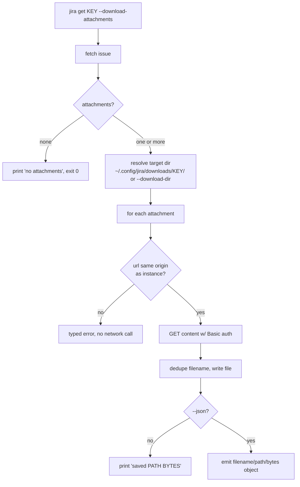

# 0020. Attachment download and external image viewer behaviors

## Context

Issues expose attachment metadata but no way to fetch the bytes. This BDR specifies
the observable behavior of the three attachment features decided in
[ADR 0029](/adr/0029-attachments-authenticated-download-seam-download-attachments-and-external-image-viewer.md):
the authenticated `download_attachment` seam (S1–S3), the `jira get
--download-attachments` flag (S4–S7), and the browse-TUI external image viewer
(S8–S9). Tracked by issues
[0060](/issues/0060-d2a-attachment-download-seam-download-attachment-on-jiraclient-with-same-origin-guard.md),
[0061](/issues/0061-d2b-jira-get-download-attachments-writes-every-attachment-to-the-config-downloads-dir.md),
and
[0062](/issues/0062-d1-browse-tui-opens-an-image-attachment-in-the-os-viewer.md).

## Behavior

## Textual Description

**Seam.** `download_attachment(url)` returns the attachment's raw bytes when `url`
is same-origin with the configured instance (same scheme, host, and port), sending
the instance's Basic-auth credentials. A cross-origin `url` is rejected with a typed
error **before any network call**, so credentials never reach a foreign host.

**Download flag.** `jira get <KEY> --download-attachments` (also valid on `jira
current`) fetches the issue, then writes every attachment to
`~/.config/jira/downloads/<KEY>/`, or to `--download-dir <DIR>` when given, creating
the directory if absent. Duplicate filenames are disambiguated with a ` (2)`, ` (3)`
suffix before the extension. In human mode each saved file prints `saved <path>
(<bytes>)`; with `--json` the command emits a curated object listing each
`{ filename, path, bytes }`. An issue with no attachments prints a clear message and
exits 0. A failed download is reported (never a false success).

**Viewer.** In the browse TUI, focusing an attachment whose mime type is `image/*`
and pressing the open key downloads it via the seam to a temp file and launches the
OS viewer (`open`/`xdg-open`/`start`). A non-image attachment keeps its existing
open-URL-in-browser behavior.

## Contract

**Public API** — the functions/methods a caller invokes:

| Symbol | Signature | Realizes |
|---|---|---|
| `JiraClient::download_attachment` | `async fn download_attachment(&self, url: &str) -> ClientResult<bytes::Bytes>` | S1–S3 |
| `config::jira_config_dir` | `fn jira_config_dir() -> PathBuf` | S4 (the `~/.config/jira/` root) |
| `download::download_dir_for` | `fn download_dir_for(root: &Path, issue_key: &str) -> PathBuf` | S4 (`<root>/downloads/<KEY>/`) |
| `download::dedupe_filename` | `fn dedupe_filename(taken: &[String], filename: &str) -> String` | S6 |

**CLI surface:**

| Invocation | Effect | Realizes |
|---|---|---|
| `jira get <KEY> --download-attachments [--download-dir <DIR>]` | writes attachments, prints saved paths | S4–S5, S7 |
| `jira get <KEY> --download-attachments --json` | emits `{ filename, path, bytes }[]` | S5 |

## Scenarios

**Scenario 1: same-origin download returns bytes**
- Given an instance `https://acme.atlassian.net` and an attachment `url` on that host
- When `download_attachment(url)` is called
- Then it performs an authenticated GET and returns the response bytes

**Scenario 2: cross-origin url is rejected before any request**
- Given an attachment `url` whose host is `evil.example.com`
- When `download_attachment(url)` is called
- Then it returns a typed error and makes no network call

**Scenario 3: 401 surfaces as the typed Unauthorized error**
- Given the instance credentials are invalid
- When `download_attachment` GETs a same-origin content url that returns 401
- Then the caller receives the typed unauthorized error

**Scenario 4: download writes every attachment to the target dir**
- Given an issue `ABC-1` with two attachments and `--download-dir <tmp>`
- When `jira get ABC-1 --download-attachments --download-dir <tmp>` runs
- Then both files exist under `<tmp>` and each saved path is printed

**Scenario 5: --json lists the saved paths**
- Given the same download as Scenario 4 with `--json`
- When the command runs
- Then stdout is one curated object listing each `{ filename, path, bytes }`

**Scenario 6: duplicate filenames are disambiguated**
- Given an issue with two attachments both named `report.pdf`
- When they are downloaded to the same dir
- Then the second is written as `report (2).pdf`; neither overwrites the other

**Scenario 7: no attachments is a clean no-op**
- Given an issue with zero attachments
- When `jira get <KEY> --download-attachments` runs
- Then a clear "no attachments" message prints and the exit code is 0

**Scenario 8: image attachment opens in the OS viewer**
- Given the browse TUI detail view with a focused `image/png` attachment
- When the open key is pressed
- Then the bytes are downloaded to a temp file and the OS viewer is launched

**Scenario 9: non-image attachment keeps browser-open behavior**
- Given a focused `application/pdf` attachment
- When the open key is pressed
- Then its URL is opened in the browser (unchanged), not the image viewer

## Test Design

| Case | Level | Input / scenario | Asserts (observable) | Proves |
|---|---|---|---|---|
| Happy path | unit (wiremock) | S1 same-origin GET | returned bytes equal served body | download contract on valid input |
| Error path | unit | S2 cross-origin url | typed error + wiremock records **zero** requests | credential-leak guard holds |
| Error path | unit (wiremock) | S3 401 | typed Unauthorized surfaced | auth failure is a contract |
| Happy path | integration | S4 two attachments to `<tmp>` | both files present, paths printed | flag writes all attachments |
| Equivalence | integration | S5 `--json` | one object with each `{filename,path,bytes}` | json contract matches human run |
| Boundary | unit | S6 duplicate names | second name `report (2).pdf`, first intact | no silent overwrite |
| Boundary | integration | S7 zero attachments | message + exit 0, no files written | empty case handled |
| Equivalence | unit | S8/S9 image vs non-image key mapping | image→`OpenAttachment`, other→open-url | mime routing correct |
| Property | unit | `dedupe_filename(taken, f)` over generated `taken` | result never ∈ `taken` | dedup uncheatable |

Rules: behavior-spec-first; assert observable behavior; mock only the out-of-process
HTTP boundary (wiremock), never fake the filesystem write in integration tests.

## Related

- ADR: [/adr/0029-attachments-authenticated-download-seam-download-attachments-and-external-image-viewer.md](/adr/0029-attachments-authenticated-download-seam-download-attachments-and-external-image-viewer.md)
- ADR: [/adr/0002-jira-cloud-only-basic-auth.md](/adr/0002-jira-cloud-only-basic-auth.md) — the single-instance auth the guard honours.
- Issues: [/issues/0060-d2a-attachment-download-seam-download-attachment-on-jiraclient-with-same-origin-guard.md](/issues/0060-d2a-attachment-download-seam-download-attachment-on-jiraclient-with-same-origin-guard.md), [/issues/0061-d2b-jira-get-download-attachments-writes-every-attachment-to-the-config-downloads-dir.md](/issues/0061-d2b-jira-get-download-attachments-writes-every-attachment-to-the-config-downloads-dir.md), [/issues/0062-d1-browse-tui-opens-an-image-attachment-in-the-os-viewer.md](/issues/0062-d1-browse-tui-opens-an-image-attachment-in-the-os-viewer.md)
