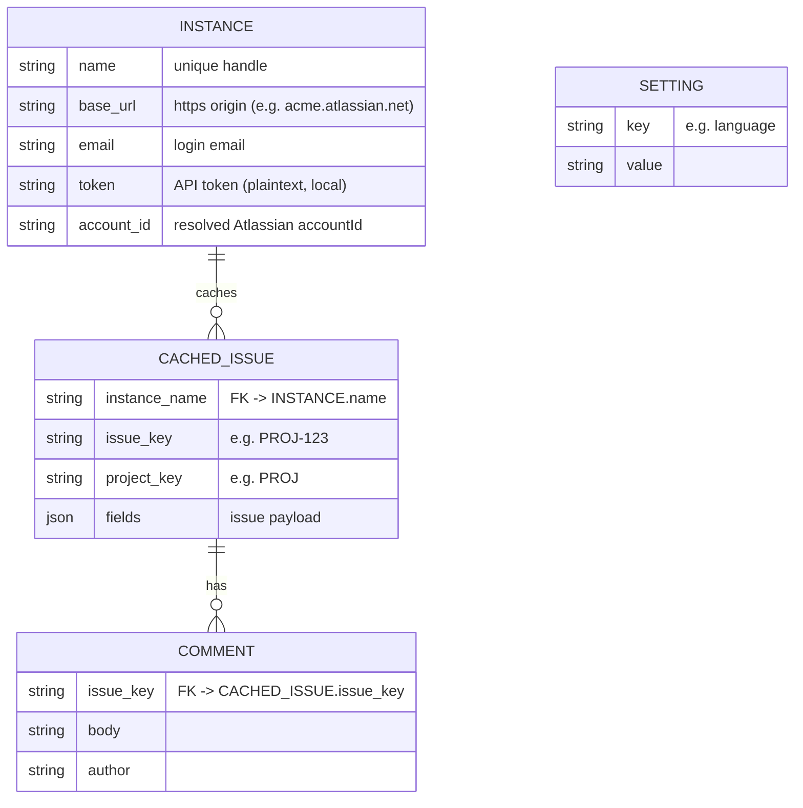

# Product Constitution

<!-- Status lives in frontmatter. Singular file — no NNNN, not indexed as a concept.
     Root of trace: every PRD/ADR/BDR/issue resolves back here. -->

## Product

`jira-cli` is a fast, local-first command-line tool for reading and browsing your
[Jira Cloud](https://www.atlassian.com/software/jira) issues across one or more
instances. It is for developers who live in the terminal and want to look up the
issue behind a branch, list what is assigned to them, run a JQL query, and read
issue detail without leaving the shell.

The codebase is a **fork of [`active-collab-cli`](https://github.com/ejklock/active-collab-cli)**
([ADR 0001](/adr/0001-fork-active-collab-cli-swap-api.md)): it inherits that
project's Rust architecture, local-first SQLite cache, `agent_json` output
contract, i18n, Docker build, and living-docs trail. Only the API/auth/domain
layer is replaced with Jira Cloud.

## Scope Boundaries

**In scope (v1):**

- A CLI with the commands `setup` (instance management), `get` (issue by key or
  URL), `current` (issue from the current git branch), `mine`/`list` (issues
  assigned to me), and `search` (arbitrary JQL).
- Multiple configured **Jira Cloud** instances, selected explicitly or inferred.
- A local SQLite cache so reads work offline and are fast.
- Dual output: a human-readable rendering and a curated, minified `agent_json`
  contract ([ADR 0004](/adr/0004-agent-json-output-contract.md)) for agents/scripts.
- Display internationalization (English and Brazilian Portuguese).

**Explicitly out of scope (v1):**

- **Writing to Jira** (creating/editing issues, commenting, transitioning status,
  logging work) — v1 is a read/browse tool. Write is a deliberate later slice,
  behind its own ADR.
- **The interactive `browse` TUI** — inherited from the AC fork but re-enabled as
  its own vertical slices after the CLI core ships
  ([ADR 0001](/adr/0001-fork-active-collab-cli-swap-api.md)).
- **Jira Server / Data Center** (REST v2 / PAT bearer) — v1 is Cloud-only
  ([ADR 0002](/adr/0002-jira-cloud-only-basic-auth.md)).
- Encryption of secrets at rest — the API token is stored in the local SQLite
  database in plaintext for now (a deliberate follow-up, tracked as an ADR).
- Native pre-built macOS/Windows release binaries — the Docker build produces a
  Linux binary; native builds are a follow-up.

**Phase boundaries:**

- **Phase 1 (v1):** Cloud-only read CLI to the command surface above, forked from
  the AC base, built and shipped via Docker.
- **Phase 2:** the interactive `browse` TUI for Jira; Jira Server/DC support;
  write operations (comment, transition); secret-at-rest encryption / OS keychain;
  native release builds.

## Data Model / Schema Foundation

An issue is identified by the pair `(instance_name, issue_key)`
([ADR 0003](/adr/0003-issue-identity-and-cache-key.md)). The Jira issue key
(`PROJ-123`) is globally unique within an instance, so — unlike the AC base, which
keyed on `(instance, project_id, task_id)` — no project component is needed in the
cache key. The cache is keyed on that pair; a refresh re-fetches from the
instance's API and overwrites the cached row. Settings are a flat key/value store.

## Non-negotiables

- **Single-binary distribution.** The shipped artifact runs with no language
  runtime, interpreter, or dependency install on the target. Falsifiable: the
  release binary runs on a clean host with nothing else installed.
- **Token host isolation.** An instance's API token is attached only to requests
  to that instance's own host, never to any other origin. Falsifiable: a request
  to a non-instance host carries no `Authorization` header.
- **Local-first.** Reads are served from the local SQLite cache when present; the
  tool is usable offline against cached data. Falsifiable: a cached `get`
  succeeds with the network disabled.
- **No telemetry.** No data leaves the user's machine except requests to the
  user's own configured Jira Cloud instances.
- **JSON/text never drift.** The `agent_json` contract and the human renderer are
  derived from the same domain helpers. Falsifiable: a field rename or drop fails
  a unit test.
- **Pure, testable core.** Domain rendering and command-resolution logic have no
  network or filesystem dependency and are unit-tested directly. Falsifiable: the
  core test suite runs with no network and no real config dir.
- **Documentation language: English.** All docs in `docs/` are written in English.

## Amendment Log

<!-- Append amendments here; do not edit sections above once ratified.
     Format: ## Amendment N — YYYY-MM-DD: 
 -->

## Amendment 1 — 2026-07-06: comment writes enter scope (parity program)

The "Writing to Jira" exclusion in **Scope Boundaries** is narrowed: **comment
writes** (create, edit, delete your own comment on an issue) are now in scope,
as part of the total-parity program with the fork base `active-collab-cli`
([PRD 0003](/prd/0003-active-collab-parity.md), [ADR 0015](/adr/0015-comment-write-enablement.md)).

Everything else stays read-only: creating/editing issues, transitioning status,
and logging work remain out of scope. The write surface is exactly the Jira
Cloud comment REST endpoints (`POST`/`PUT`/`DELETE` on
`/rest/api/3/issue/{key}/comment`), host-pinned per the token-isolation
non-negotiable. Falsifiable: no code path issues a non-GET request to any
endpoint other than the comment endpoints.
